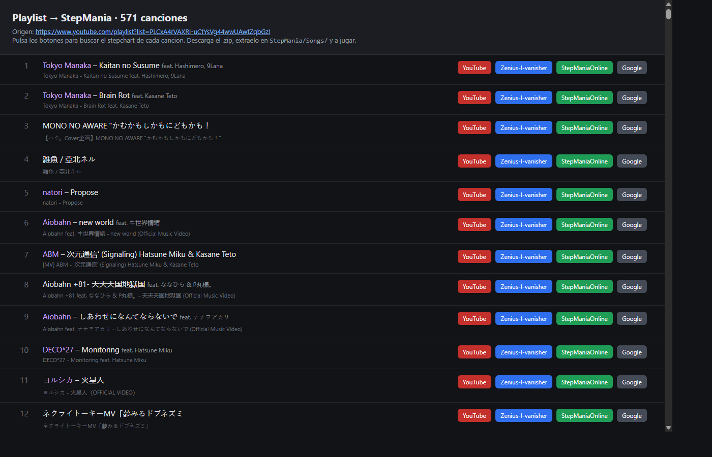

# playlist-to-stepmania

Extrae todas las canciones de una **playlist de YouTube** y genera un informe
(HTML + CSV) con **enlaces de búsqueda directos** a webs de simfiles para
encontrar y descargar los stepcharts de cada canción en
[StepMania](https://www.stepmania.com/).

> YouTube solo te da el audio. Este script no genera las flechas: te ayuda a
> **localizar rápidamente** el stepchart de cada canción en las webs de la
> comunidad para que solo tengas que descargarlo y soltarlo en `StepMania/Songs/`.



## Qué hace

1. **Extrae** las canciones de la playlist con [`yt-dlp`](https://github.com/yt-dlp/yt-dlp) (solo metadatos, sin descargar).
2. **Limpia** cada título separándolo en artista / canción / colaboradores
   (quita `Official Video`, `[MV]`, `feat.`, corchetes japoneses `【】`, etc.).
3. **Genera enlaces de búsqueda** por cada canción a:
   - **Zenius-I-vanisher** (vía Google `site:` incluyendo artista)
   - **StepManiaOnline** (`stepmaniaonline.net/search/title/...`)
   - **Google** genérico (`artista canción stepmania simfile`)
4. **Produce** un informe:
   - `playlist_stepmania.html` — tabla con botones clicables (se abre solo)
   - `playlist_stepmania.csv` — para abrir en Excel / filtrar

## Requisitos

- Python 3.9+
- [`yt-dlp`](https://github.com/yt-dlp/yt-dlp)
- [`ffmpeg`](https://ffmpeg.org/) en el `PATH` (solo si usas `--download-audio`)

```bash
pip install yt-dlp
```

## Uso

```bash
python playlist_to_stepmania.py "URL_DE_LA_PLAYLIST"
```

### Opciones

| Opción | Descripción |
| --- | --- |
| `--out PREFIJO` | Prefijo de los archivos de salida (por defecto `playlist_stepmania`). |
| `--download-audio` | Descarga también los MP3 de la playlist (requiere `ffmpeg`). |
| `--no-open` | No abrir el informe HTML al terminar. |

### Ejemplos

```bash
# Generar el informe y abrirlo en el navegador
python playlist_to_stepmania.py "https://www.youtube.com/playlist?list=XXXX"

# Cambiar el nombre de salida y no abrir el HTML
python playlist_to_stepmania.py "URL" --out mi_lista --no-open

# Descargar también el audio (MP3) de toda la playlist
python playlist_to_stepmania.py "URL" --download-audio
```

## Web local (introducir la URL desde el navegador)

Si prefieres pegar la URL en un campo de texto en lugar de pasarla por línea de
comandos, hay una web local que usa solo la librería estándar de Python
(`http.server`, **sin dependencias extra**):

```bash
python server.py                 # arranca en http://localhost:8000
python server.py --port 9000     # otro puerto
python server.py --no-open       # no abrir el navegador automáticamente
```

Se abre un formulario, pegas la URL de la playlist, pulsas **Buscar** y te
muestra la tabla con los enlaces de búsqueda de cada canción. Para parar el
servidor, pulsa `Ctrl+C`.

## Cómo jugar las canciones encontradas

1. Abre el informe HTML y pulsa los botones de búsqueda de cada canción.
2. Si existe el stepchart, descarga el `.zip`.
3. Extráelo dentro de la carpeta `StepMania/Songs/`.
4. Reinicia StepMania y ¡a jugar!

## Notas

- La búsqueda de disponibilidad no es automática: las webs de simfiles no tienen
  una API pública estable, así que el script deja la búsqueda a un clic.
- La limpieza de títulos cubre la mayoría de casos, pero algunos títulos muy
  irregulares pueden necesitar un ajuste manual del término de búsqueda.

## Licencia

[MIT](LICENSE)
